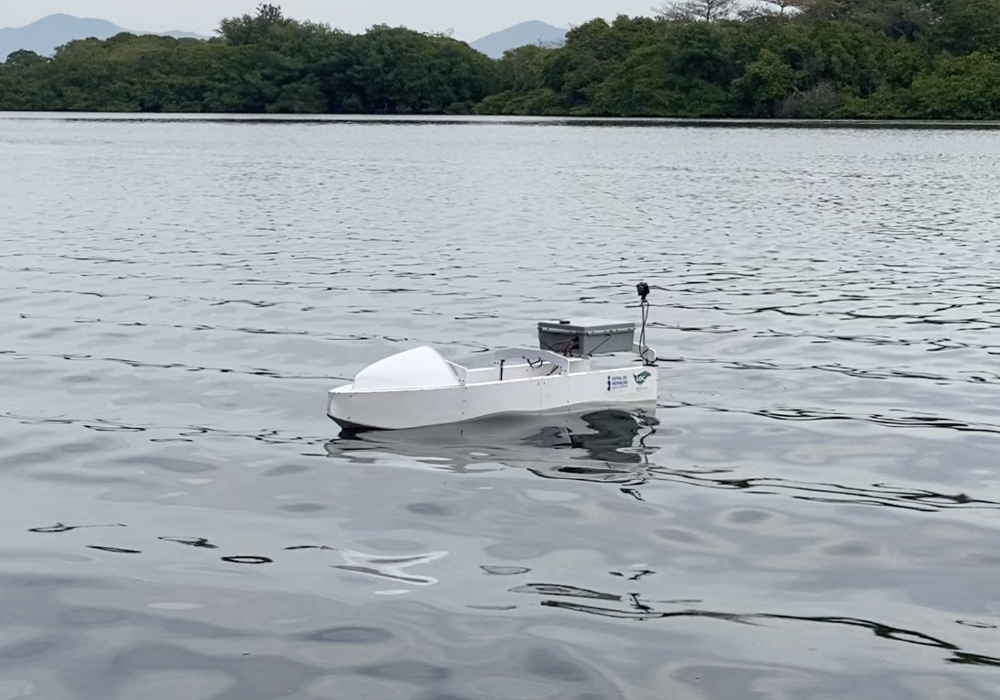

## DH200 ASV (Dragon Head 200 Autonomous Surface Vessel)




### .

[](https://www.youtube.com/watch?v=OJGZz4xJ2k4)

## Description

`dh200_asv` is a repository for the paper "A low cost, open-source, multipurpose autonomous surface vehicle".

The repository is structured by folders, each one with the following content:

- **`loc_mind`** – the “operating system” that runs inside the Raspberry Pi is here, as well as the graphical user interface (GUI) that runs in the land station. All the code is written in Python. Here, we call **LOC MIND** the _Modular Intelligent Navigation Device (MIND)_ created at the _Laboratório de Ondas e Correntes (LOC)_.
- **`rhino_files`** – a 3D CAD model for those who are familiar with the Rhinoceros software. This model contains the fully-opened hull configuration.
- **`fusion_files`** – a 3D CAD model for those who are familiar with the Fusion software. This model contains the fully-opened hull configuration with all details of screws, PVC sheets, electronic box, and so on.
- **`cnc_files`** – CNC (Computer Numerical Control) router files for those interested in replicating the hull of the ASV. The files (CRV3D format) are already prepared to be used in CNC machines.
- **`hydrostatics`** – this folder contains the hydrostatics table and the stability table, which are crucial for those planning to explore the capabilities of the ASV.
- **`hydrodynamics`** – as illustrated at the beginning of the paper, this folder contains tables of added mass and damping, load RAOs (Response Amplitude Operators), and displacement RAOs.
- **`docs`** – the main steps to replicate the ASV hull and electronics are in this folder, which contains PDF files and spreadsheets.
- **`media`** – this folder contains pictures and videos of the built ASV.


## Citing the Project

If you make use of the DH200 for your research, please cite our publication. Here is the corresponding BibTeX entry:

```
@article{Benatti2025,
    year = {2025},
    author = {Thomaz Augusto Kras Benatti and Emerson Martins de Andrade and Maicon Rodrigo Correa and Felipe da Silva Lopes and João Paulo Machado dos Santos Bernardino and Joel Sena Sales Jr and Antonio Carlos Fernandes},
    title = {A low cost, open-source, multipurpose autonomous surface vehicle},
}
```

## Contributing to the project
All kind of contributions are welcome: 
* Improvement of code with new features, bug fixes, and  bug reports
* Improvement of documentation
* Additional tests

If you have any ideas or questions, feel free to open an issue or contact us.

## Acknowledgements
The authors would like to thank the Programa de Recursos Humanos da Agência Nacional do Petróleo, Gás Natural e Biocombustíveis (PRH18-ANP) for their support, supported with resources from investment by oil companies qualified in the P, D\&I Clause of ANP Resolution no. 50/2015. This work was supported by the National Council for Scientific and Technological Development (CNPq), the Foundation for Research Support of the State of Rio de Janeiro (FAPERJ) through the ''Jovem Cientista do Nosso Estado'', the Instituto Reditus through the ''Edital de Inovação'', and [LOC/COPPE/UFRJ](https://www.loc.ufrj.br/index.php/en/) ([Laboratory of Waves and Current](https://www.loc.ufrj.br/index.php/en/) - [Federal University of Rio de Janeiro](https://ufrj.br/en/)).
